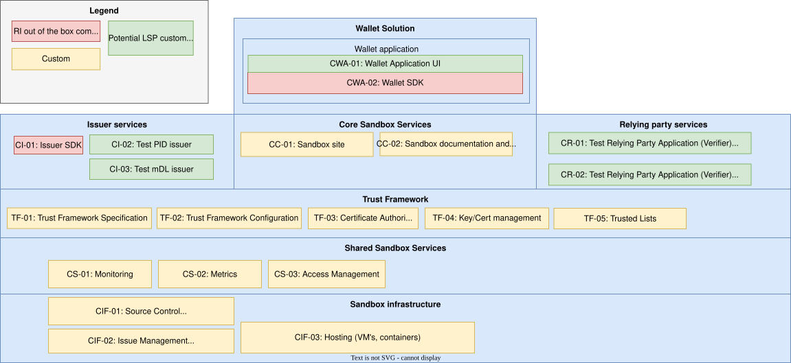
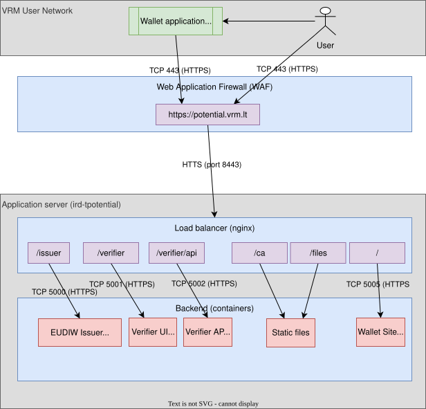

# Sandbox Environment for EU Digital Identity Wallet Potential LSP

## Metadata

| Keyword     | Value                                          |
| ----------- |:--------------------------------------------- |
| **Version** | 1.0.0                                           |
| **Date**    | 2025-09-30                                     |
| **Status**  | FINAL                                          |
| **Author**  | Gytis Raciukaitis (<gytis.raciukaitis@vrm.lt>) |

## Version History

| Version | Date       | Changes       |
| ------- | ---------- |:------------- |
| 1.0.0   | 2025-09-30 | Final version |

## Terms and Definitions

| Term                | Definition                                                                                                                                                                                    |
| ------------------- | --------------------------------------------------------------------------------------------------------------------------------------------------------------------------------------------- |
| EIDAS2              | Regulation (EU) 2024/1183 of the European Parliament and of the Council of 11 April 2024 amending Regulation (EU) No 910/2014 as regards establishing the European Digital Identity Framework |
| EUDIW               | EU Digital Identity Wallet                                                                                                                                                                    |
| ARF                 | Architecture and Reference Framework                                                                                                                                                          |
| SANDBOX             | The environment implemented as part of this initiative                                                                                                                                        |
| SANDBOX ENVIRONMENT | See **SANDBOX**                                                                                                                                                                               |
| SDK                 | Software Development Kit                                                                                                                                                                      |
| QES                 | Qualified Electronic Signature                                                                                                                                                                |
| rQES                | remote Qualified Electronic signature                                                                                                                                                         |
| LSP                 | European Union Large Scale Pilot project                                                                                                                                                      |
| mDoc                | Mobile Document as per ISO-18013 standard                                                                                                                                                     |
| IACA                | Issuing Authority Certificate Authority is a X.509 based certificate used to identify an mDoc issuer and verify the mDocs they issue                                                          |
| HSM                 | Hardware Security Module                                                                                                                                                                      |
| CRL                 | Certificate Revocation List (X.509 standard)                                                                                                                                                  |
| OpenID4VP           | OpenID for Verifiable Presentations                                                                                                                                                           |
| OpenID4VCI          | OpenID for Verifiable Credentials Issuance                                                                                                                                                    |
| Trust Anchor        | The trust path as identified by X.509 standard                                                                                                                                                |
| LSP                 | EU Large Scale Pilot project                                                                                                                                                                  |

## References

The section provides a list of referenced documentation, legal and technical
standards.

- Legislature
  - [EIDAS2 regulation (EU - 2024/1183)](https://eur-lex.europa.eu/eli/reg/2024/1183/oj/eng)
- Architecture
  - [Architecture and Reference Framework (ARF)](https://eu-digital-identity-wallet.github.io/eudi-doc-architecture-and-reference-framework/latest/)
- Technical
  - [EU Reference wallet implementation](https://github.com/orgs/eu-digital-identity-wallet)
- Standards
  - [Standards status and roadmap for EU Digital Identity Wallet](https://github.com/orgs/eu-digital-identity-wallet/projects/29)
  - [OpenID for Verifiable Credentials Issuance (OpenID4VCI)](https://openid.net/specs/openid-4-verifiable-credential-issuance-1_0.html)
  - [OpenID for Verifiable Presentations (OpenID4VP)](https://openid.net/specs/openid-4-verifiable-presentations-1_0.html)
  - [IETF - \# Token Status List (TSL)](https://datatracker.ietf.org/doc/draft-ietf-oauth-status-list/)
  - [ISO/IEC 18013-5 - Mobile driving licence (mDL) application](https://www.iso.org/standard/69084.html)
  - [X.509 - Public-key and attribute certificate frameworks](https://www.itu.int/rec/T-REC-X.509)

## Summary

The document details the possible implementation of the sandbox environment using EU EUDIW Reference implementation (<https://github.com/eu-digital-identity-wallet>).

The implementation provides a simplified environment limiting the usability in following areas:

- The transactional data is non-serialized as persistent database storage is not supported.
- Hard to track cross-component releases. The Reference Implementation does not provided a consistent versioning and baselines.
- Security implications - the code is for experimentation and standard development and does not necessarily meet security standards
- Code quality issues
- Lack of commercial support

## Architecture Overview and Components

The architecture implementation using the available components from the EU Reference implementation shown bellow.

<figure>

<figcaption aria-hidden="true">Figure 1: Architecture Overview</figcaption>
</figure>

### Core Sandbox Services

Core services include general documentation site and Trust Framework configuration.

#### CC-01 Sandbox Site

The static site built as a landing page for the environment. Contains the instructions the wallet installation, usage and links to key resources, such as Issuing Authority Certificate Authority (IACA) and issuer signing certificates.

Provided as a simple [Hugo](https://gohugo.io/) application.

The application is hosted at [Potential EUDIW Lithuania Testing Environment](https://potential.vrm.lt/).

Source code available at [GitLab - Potential Site](https://gitlab.vrm.lt/potential-wallet/eudi-lt-potential-site).

#### CC-02 Sandbox Documentation and Specifications

The documented list of standards and versions supported by the sandbox. Also
includes the sandbox guidance documentation. Deployed as part of [\#CC-01
Sandbox site](#CC-01 Sandbox site "wikilink").

### Trust Framework

The trust framework for the sandbox defines implements the EU Digital Identity Wallet's Trust Model defined in the Architecture Reference Framework.

The source code for the generation of the Certificate Authority and related certificates is provided at [Gitlab - CA generator](https://gitlab.vrm.lt/potential-wallet/ca-generator) and the actual configuration is part of the infrastructure deployment source code repository at [Gitlab - Potential infrastructure](https://gitlab.vrm.lt/potential-wallet/eudiw-lt-infra).

#### TF-01 Trust Framework Specification

The trust framework specification is the following:

- Using X.509 certificates
- One tier X.509 (root CA only) self signed IACA
- Single certificate revocation list, hosted on a URL accessible to the Wallet
  application
- Issuer and relying party certificates will be created according to the
  ISO-18013:5 specification and will be signed by the CA
  - created according to the ISO-18013:5 specification and will be signed by the
    CA
  - having a valid Alternative Issuer name pointing to the allocated domain for
    the environment (see [\#SSL and DNS Configuration](#SSL and DNS
    Configuration "wikilink"))
- Relying party certificates
  - created according to the ISO-18013:5 specification and will be signed by the
    CA
  - having a valid Alternative Issuer name pointing to the allocated domain for
    the environment (see [\#SSL and DNS Configuration](#SSL and DNS
    Configuration "wikilink"))

#### TF-02 Trust Framework Configuration

The trust framework implementation in Reference Implementation is simple and statically embedded in the configuration of other components. The following are the key parameters for the Trust Framework:

- A single root IACA (Issuing Authority Certificate Authority) X.509 certificate and CRL (Certificate Revocation List). Both must be available online and reachable by the wallet and relying party applications.
- Issuer signing certificates for signing issued attestations. Signed by the root IACA and distributed to be available publicly for other relying party applications to include in their trust lists.
- Test relying party request signing certificate for signing relying party requests to the wallets. Signed by the root IACA and distributed to be publicly available for the other wallet applications to include in their trust lists.

#### TF-03 Certificate Authorities

The sandbox uses a single root self signed certificate authority and X.509 security framework.

#### TF-04 Key and Certificate Management

The sandbox uses file based keys and certificates and software based security operations as the full pledged Hardware Security Module (HSM) is not required for the sandbox usage and security level.

#### TF-05 Trusted Lists

The party trust lists are implemented as static list of trusted X.509 certificate Trust Anchors in each of the sandbox applications. Other parties outside the sandbox (such as relying parties or wallets) must add the provided Issuer and Relying party request singing certificates in to their trust framework, that includes also trusting the root Certificate Authority.

### Shared Sandbox Services

The shared sandbox services provide extra features that are shared across all components.

#### CS-01 Monitoring

The application availability and logs monitoring. This is required for the debugging of the sandbox environment during wallet testing events and support.

#### CS-02 Metrics

An optional component to track the usage of the environment as well as test case reporting when participating in the EU projects or collaborations.

### Wallet Application Components

The Reference Implementation provides a demo application for the wallet and the libraries to be able to build functional wallet applications for Android and iOS.

#### CWA-01 Wallet Application and UI

The wallet application built for the environment. For the sandbox implementation only Android version will is used.

The source code is available at [Gitlab - Wallet application](https://gitlab.vrm.lt/potential-wallet/eudi-app-android-wallet-ui)

#### CWA-02 Wallet SDK

The libraries used to build the wallet applications. Provide the basis for the reference wallet application. The code is provided in the Reference Implementation [Github](https://github.com/eu-digital-identity-wallet).

### Issuer Services

The Reference Implementation provides a limited code base for the issuer services, that include test issuers and basic implementation for the revocations management.

#### CI-01 Issuer SDK

The libraries to build the issuer. In the reference implementation this is provided as a set of Java and Python libraries to deal with the [OpenId4VCI](https://openid.net/specs/openid-4-verifiable-credential-issuance-1_0.html#name-overview) protocol and attestation signing. The code is available at [Github](https://github.com/eu-digital-identity-wallet).

#### CI-02 Test PID Issuer

The issuer for the test PID attestations to allow easy testing.

The issuer is available at [Lithuania EUDIW Testing Issuer](https://potential.vrm.lt/issuer).

The code is available at [GitLab - Issuer](https://gitlab.vrm.lt/potential-wallet/eudi-srv-web-issuing-eudiw-py).

#### CI-03 Test mDL Issuer

The issuer for the test Mobile Driving Licence (mDL) attestations to allow easy testing.

The issuer is available at [Lithuania EUDIW Testing Issuer](https://potential.vrm.lt/issuer).

The code is available at [GitLab - Issuer](https://gitlab.vrm.lt/potential-wallet/eudi-srv-web-issuing-eudiw-py).

### Relying Party Services

#### CR-01 Test Relying Party Application - Verifier UI

The verifier component provides a test implementation for the relying party (implementing [OpenID4VP](https://openid.net/specs/openid-4-verifiable-presentations-1_0.html) protocol) and ISO-80013:5. The application provides the customized user interface to verify the credentials from the wallet.

The application is hosted at [VerifierUi](https://potential.vrm.lt/verifier/home).

The source code is available at [Gitlab - Verifier UI](https://gitlab.vrm.lt/potential-wallet/eudi-web-verifier).

#### CR-02 Test Relying Party Application - Verifier Backend

The verifier component provides a test implementation for the relying party (implementing [OpenID4VP](https://openid.net/specs/openid-4-verifiable-presentations-1_0.html) protocol) and ISO-80013:5. The application provides the customized user interface to verify the credentials from the wallet.

The application is hosted at [Verifier API](https://potential.vrm.lt/verifier/api/swagger-ui).

The source code is available at [Gitlab - Verifier Backend](https://gitlab.vrm.lt/potential-wallet/eudi-srv-web-verifier-endpoint-23220-4-kt).

### Sandbox Infrastructure

Sandbox infrastructure provides the necessary supporting and hosting infrastructure.

#### CF-01 Source Control

Source code repositories will be hosted in IRD GItlab.

#### CF-02 Issue Management

Issue management for the sandbox will use the IRD Gitlab.

#### CF-03 Hosting

The sandbox hosting target is the IRD environment using a virtual machine hosting and Docker containers.

## Infrastructure Specification

The sandbox components can installed either in the Google Cloud environment or using virtual machines.

### Virtual Machines and Docker Deployment

The following section describes the infrastructure and setup required to host the application on a virtual machine using Docker containers and using either a single DNS host name with path based routing or virtual hosts.

<figure>

<figcaption aria-hidden="true">Figure 2: Infrastructure implementation</figcaption>
</figure>

#### Server Configuration

The following server configuration required:

- CPU: 4 Cores (4GHz)
- RAM: 8 GB
- Disk: SSD - 20 GB (including OS)
- OS: Linux
- Software: Docker/Podman, Caddy Reverse Proxy.

### Network Configuration

The components need to be accessible from the public network on the 443 (SSL) ports to be available to access for the wallet application.
